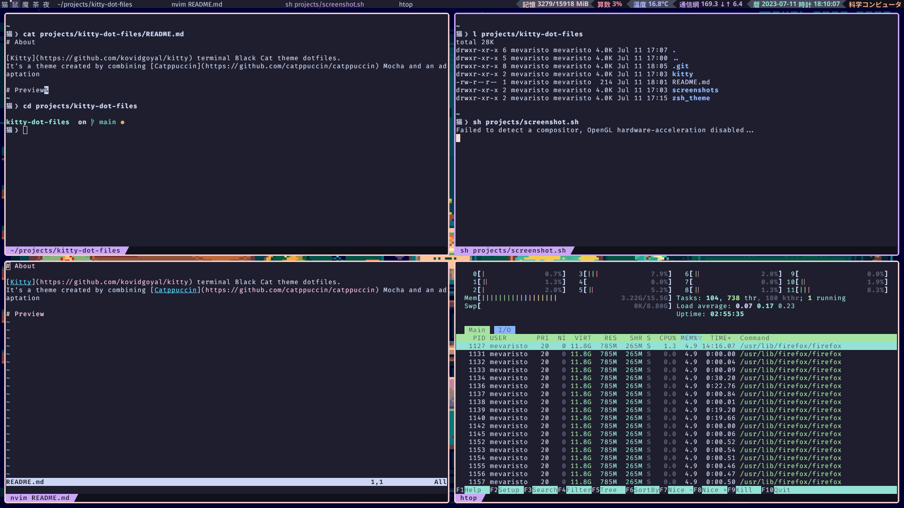

# About

[Kitty](https://github.com/kovidgoyal/kitty) terminal Black Cat theme dotfiles.
It's a theme created by combining [Catppuccin](https://github.com/catppuccin/catppuccin) Mocha and an adaptation of [Oxide](https://github.com/dikiaap/dotfiles) Oh My Zsh Theme.

# Preview



Note: borders and lack of titlebar are from my WM config.

# Usage

## Kitty

If you only want to use the color theme for kitty, just follow instructions directly from [Catppuccin Kitty theme page](https://github.com/catppuccin/kitty).

You could also copy my own `theme.conf` from `kitty` and import it inside your `~/.config/kitty/kitty.conf`:

```config
include theme.conf
```

But I have platform (`Linux`) and WM specific tweaks in it (like lack of titlebar and borders).

## Oh My Zsh

Copy the theme file to your zsh themes directory:

``` sh
cp ./zsh_theme/black-cat.zsh-theme {zsh-themes}/black-cat.zsh-theme
```

Import it replacing this line to `~/.zshrc` (assuming you have already installed Oh My Zsh):

```sh
ZSH_THEME="black-cat"

```

# Notes

I'm using AwesomeWM, but I'm still working on it's configuration. Maybe I'll upload it's dotfiles in the future.

猫 is the Japanese Kanji for cat.